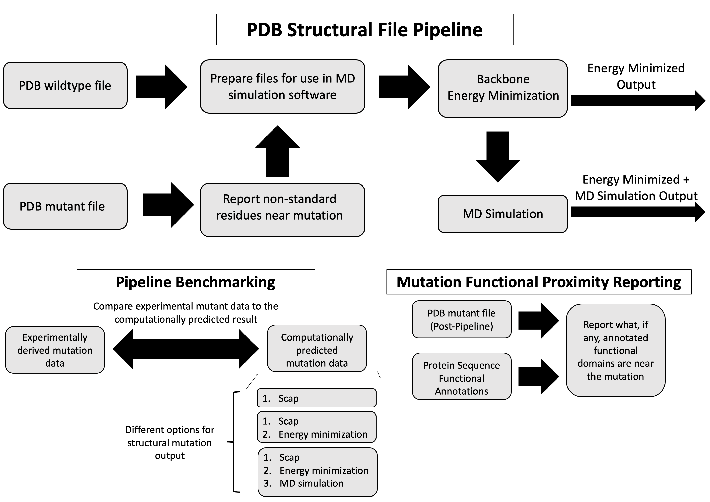

# Local Force Field Adjustment and Differential Analysis of Structure Mutations in iCn3d

## Introduction

iCn3D is a web application to vizualize and analyze structural data. One feature is to introduce mutations to the protein for comparison of the original structure and mutant variant. Currently, the structure is processed using scap, a program to predict side-chain conformations. However, no additional structural prediction for the mutation is done, such as how the backbone for the residue might change. 

## What this project aims to do

This project seeks to offer additional improvements to the mutation structure estimation by predicting the conformational changes for the backbone and through MD simulations. The results are to be benchmarked by comparing the computationally predicted structures to experimentally derived structures (Dehouck *et al.*, 2009; Dehouck *et al.*, 2011). To aid in differential analysis, information on annotated functional regions of proteins from uniprot (UniProt Consortium 2021) and their distance to a mutation will also be provided as a new feature. 

## Project Workflow

Information on the analysis workflow can be found on the [wiki](https://github.com/hackathonismb/differential-analysis-of-residue-interactions-of-a-SNP-based-on-side-chain-prediction/wiki).

## Team

- Zachery Mielko
- Kailash Adhikari
- David Bell
- Jiyao Wang
- Marina Herrera Sarrias
- Ravinder Abrol

## Citations

Dehouck, Y., Grosfils, A., Folch, B., Gilis, D., Bogaerts, P. and Rooman, M., 2009. Fast and accurate predictions of protein stability changes upon mutations using statistical potentials and neural networks: PoPMuSiC-2.0. Bioinformatics, 25(19), pp.2537-2543.

Dehouck, Y., Kwasigroch, J.M., Gilis, D. and Rooman, M., 2011. PoPMuSiC 2.1: a web server for the estimation of protein stability changes upon mutation and sequence optimality. BMC bioinformatics, 12(1), pp.1-12.

 "UniProt: the universal protein knowledgebase in 2021." Nucleic acids research 49, no. D1 (2021): D480-D489.

